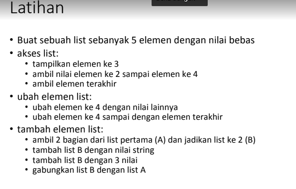
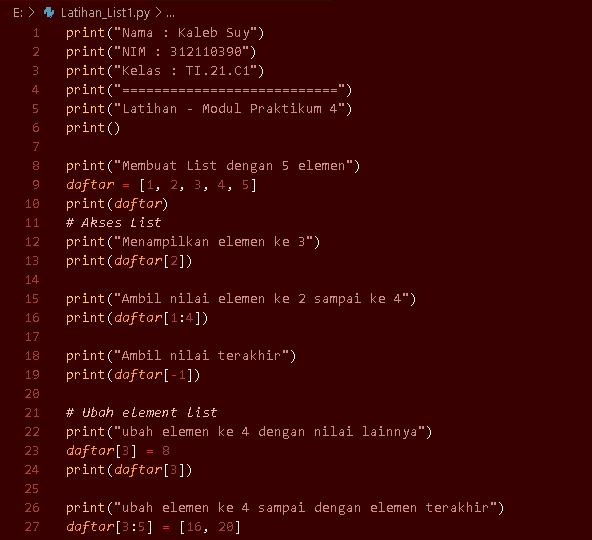
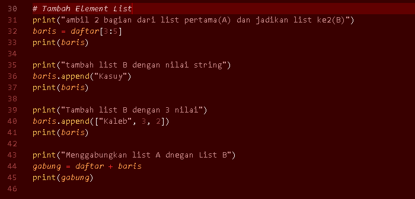
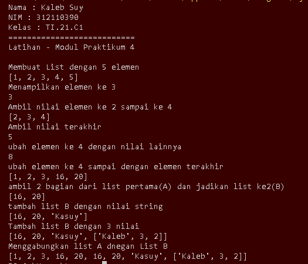
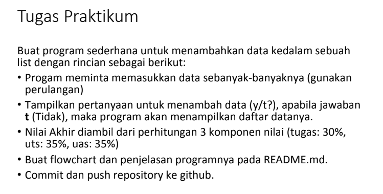
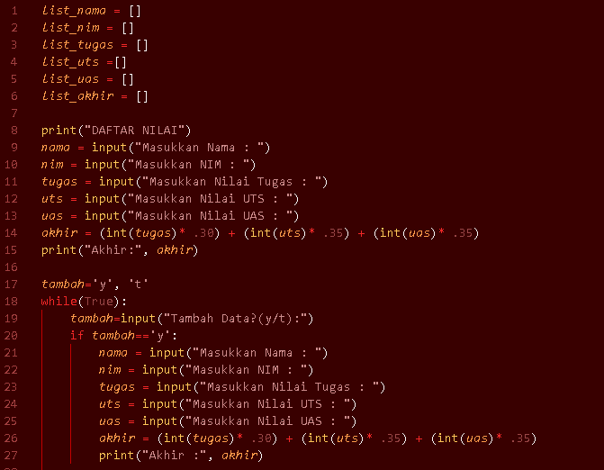
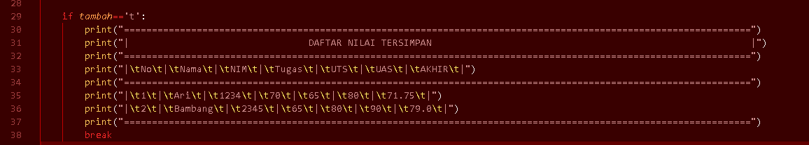
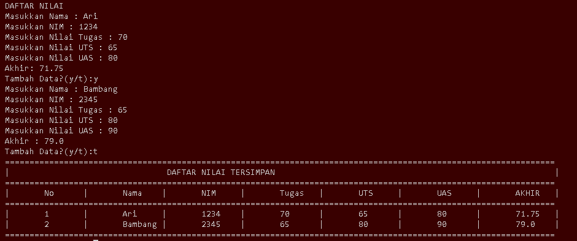
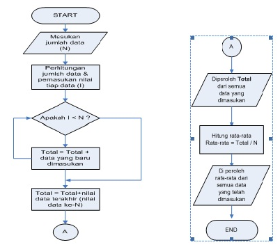

# Tugas_Kaleb4
# Tugas_Praktikum4
## Latihan Pengulangan List
Latihan 

Berikut adalah program yang saya buat 

Hasil exekusi program 

### Tugas Praktikum
Praktikum 4 

Berikut adalah tampilan program 

Berikut adalah tampilan eksekusi program 

FLOWCHART 

Sekian Tugas yang saya kerjakan. 

TERIMAKASIH